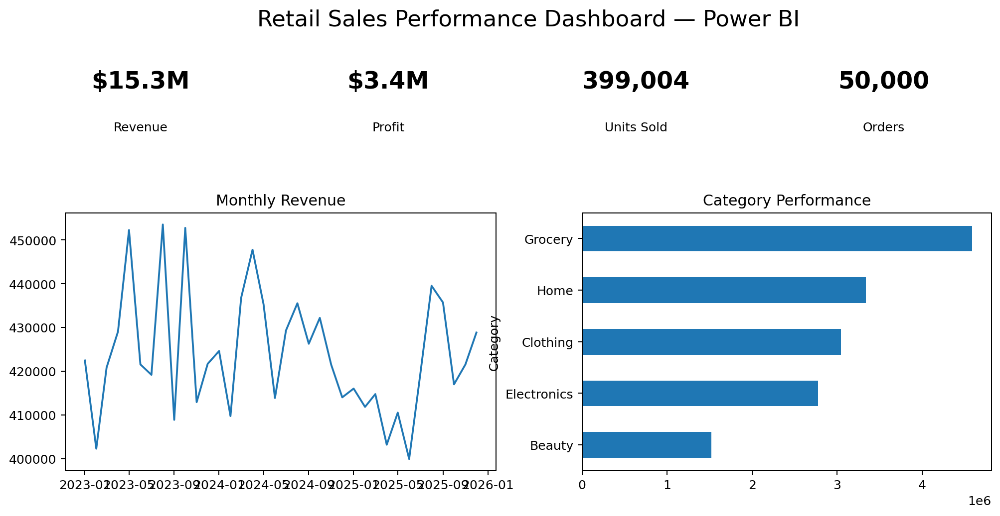

# Retail Sales Performance Dashboard

**Power BI | SQL | Python | Microsoft Excel | Pandas**

## Project Overview

An end-to-end retail sales analytics project that evaluates revenue, profit, regional performance, product categories, and monthly sales trends using SQL, Python, and Power BI.

## Business Problem

Retail managers need a centralized dashboard to monitor business performance, identify high-performing regions and product categories, and support data-driven sales planning.

## Objectives

- Analyse 50,000 retail transactions
- Identify revenue and profit trends
- Compare regional and category performance
- Build interactive Power BI KPIs
- Generate business recommendations for sales growth

## Tools & Technologies

- Power BI
- SQL
- Python (Pandas, Matplotlib)
- Microsoft Excel

## Dataset

**50,000 retail sales transactions** containing:

- Date
- Region
- Category
- Product
- Sales Channel
- Units Sold
- Revenue
- Profit

## Dashboard KPIs

| KPI | Value |
|---|---:|
| Orders | **50,000** |
| Revenue | **$15.26M** |
| Profit | **$3.37M** |
| Units Sold | **399,004** |
| Top Region | **South** |
| Top Category | **Grocery** |

## Results & Findings

- The **South** region generated the highest revenue and should be prioritised for expansion.
- **Grocery** was the strongest performing category across total sales.
- Monthly revenue trends reveal seasonal demand patterns useful for inventory planning.
- Category and regional comparisons help identify underperforming business segments.
- Revenue and profit should be reviewed together so strong sales growth does not hide weaker margins.

## Dashboard Output

The Power BI dashboard includes:

- Revenue & Profit KPI cards
- Monthly Sales Trend
- Regional Performance
- Category Performance
- Interactive slicers for region, category and channel



## Business Recommendations

1. Increase inventory allocation for high-performing regions.
2. Focus promotional campaigns on weaker categories.
3. Use monthly trend analysis for demand planning and sales targets.
4. Monitor profit alongside revenue when evaluating regional performance.

## Project Structure

```text
Retail-Sales-Performance-Dashboard/
├── data/
├── notebooks/
├── sql/
├── dashboard/
├── images/
├── requirements.txt
└── README.md
```

## How to Run

```bash
pip install -r requirements.txt
jupyter notebook notebooks/retail_sales_performance.ipynb
```

## Conclusion

This project demonstrates a complete retail analytics workflow from data preparation and SQL analysis to interactive Power BI reporting and business decision support.